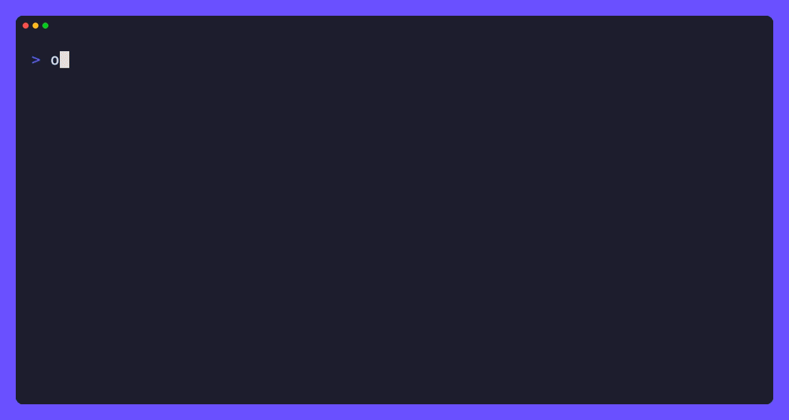

# opencode-sdd

[](https://github.com/ameshkov/opencode-sdd/actions/workflows/ci.yml)
[](https://www.npmjs.com/package/opencode-sdd)
[](https://github.com/ameshkov/opencode-sdd/releases)

<p align="center">
    Specification-Driven Development for OpenCode.
</p>

<p align="center">
    
</p>

You describe what you want in vague terms.
The plugin produces a complete, validated development plan — PRD, issues,
implementation plans, and validation reports — with every phase running in a
clean, isolated session.

## Table of Contents

- [The Problem](#the-problem)
- [The Solution](#the-solution)
- [Install](#install)
- [The SDD Short Flow](#the-sdd-short-flow)
- [The PRD Long Flow](#the-prd-long-flow)
- [Keeping Documentation Current](#keeping-documentation-current)
- [Honorable Mentions](#honorable-mentions)
- [Additional Resources](#additional-resources)

## The Problem

AI coding agents are great at writing code, but they're terrible at *planning*
code. You tell an agent “build a payment system” and it starts typing without
requirements, architecture, or validation. By the time you realize it built the
wrong it built the wrong thing, you’ve burned a session full of context and
a pile of tokens.

## The Solution

**opencode-sdd** is a tool that let's you have a proper workflow:
**plan everything before you build anything.**

## Install

Add `opencode-sdd` to the `plugin` array in your project's `opencode.json`
(or `opencode.jsonc`):

```json
{
    "$schema": "https://opencode.ai/config.json",
    "plugin": ["opencode-sdd"]
}
```

opencode installs the plugin from npm on startup. Restart opencode (or start
a new session) to load it; the `/sdd-*`, `/prd-*` and `/doc-*` commands become
available immediately.

## The SDD Short Flow

For a small change you can analyze, implement, and verify in three commands.
Each command runs with your current agent — no dedicated orchestrator is
required.

1. Describe the change and produce a lightweight plan.
2. Implement the plan's tasks following the TDD flow.
3. Validate the result and write a report.

- `/sdd-spec` — analyze a problem and write `SPECS_DIR/spec.md`
  (problem analysis, affected files, proposed solution, and tasks).
- `/sdd-implement` — run the tasks defined in `spec.md` using the TDD flow
  (write failing test → verify failure → implement → verify pass).
- `/sdd-validate` — validate the implementation and write
  `SPECS_DIR/validation.md`.

`SPECS_DIR` defaults to `.sdd/.current/`.

It's up to you whether you want to keep that directory in source control.

## The PRD Long Flow

For a larger feature, drive requirements through validated implementation in
six steps. Each step runs in a clean session and produces the next artifact.

1. Write a product spec from a feature description.
2. Break the spec into independent vertical-slice issues.
3. Plan a single issue.
4. Implement that issue's plan.
5. Validate that issue against its plan.
6. Cross-validate every implemented issue.

- `/prd-write` — produce `SPECS_DIR/prd.md` from a feature description.
- `/prd-to-issues` — write vertical-slice issues under `SPECS_DIR/issues/`.
- `/prd-issue-to-plan` — write a plan for one issue.
- `/prd-implement-issue` — run one issue's plan.
- `/prd-validate-issue` — validate one issue against its plan.
- `/prd-validate` — cross-validate all implemented issues and write
  `SPECS_DIR/validation.md`.

## Keeping Documentation Current

The `doc-*` commands update the project's standard documentation files to
match the codebase. Run them after a change that affects the corresponding
file.

- `/doc-readme` — update `README.md` to stay a user manual.
- `/doc-development` — update `DEVELOPMENT.md` (build and debug guide).
- `/doc-deployment` — update `DEPLOYMENT.md`.
- `/doc-agents` — update `AGENTS.md` (guidelines and project structure).
- `/doc-changelog` — add the Unreleased entry to `CHANGELOG.md`.

## Honorable Mentions

- [ascii-gif](https://github.com/tamnd/ascii-gif) — used to generate the
  demo GIF in this README.
- [spec-kit](https://github.com/github/spec-kit) — this project was
  originally inspired by GitHub's Spec Kit, but is essentially a simplified
  version of it.

## Additional Resources

- [AGENTS.md](./AGENTS.md) — code guidelines, project structure, and the
  plugin surface contract.
- [DEVELOPMENT.md](./DEVELOPMENT.md) — build and debug guide.
- [CHANGELOG.md](./CHANGELOG.md) — release history.
- [`docs/e2e.md`](./docs/e2e.md) — how the mock-LLM e2e suite works,
  including the template-rewriting mechanism.
